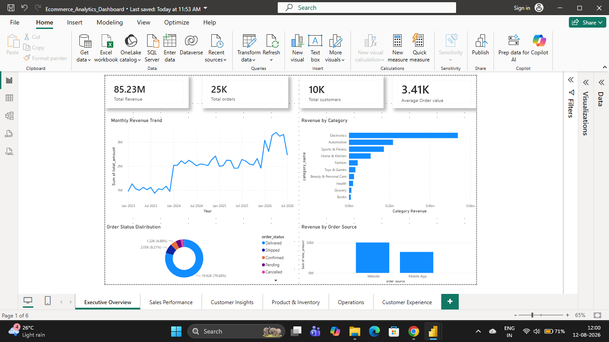
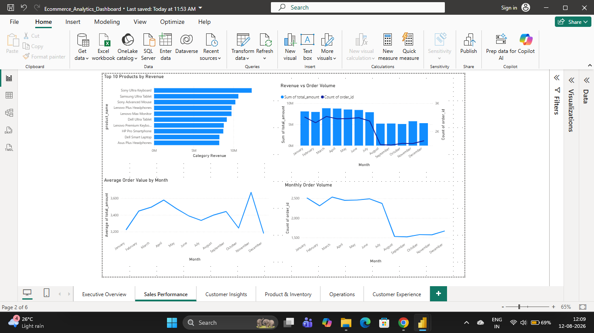
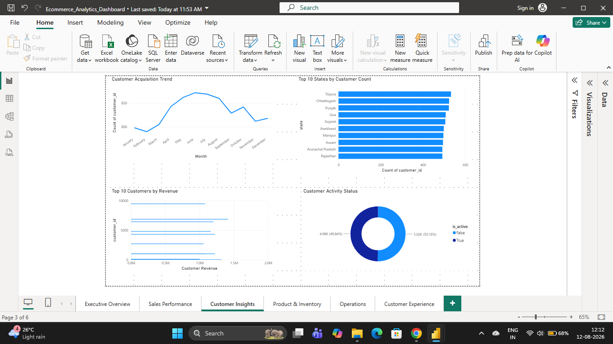
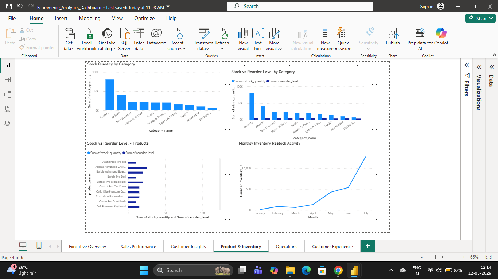
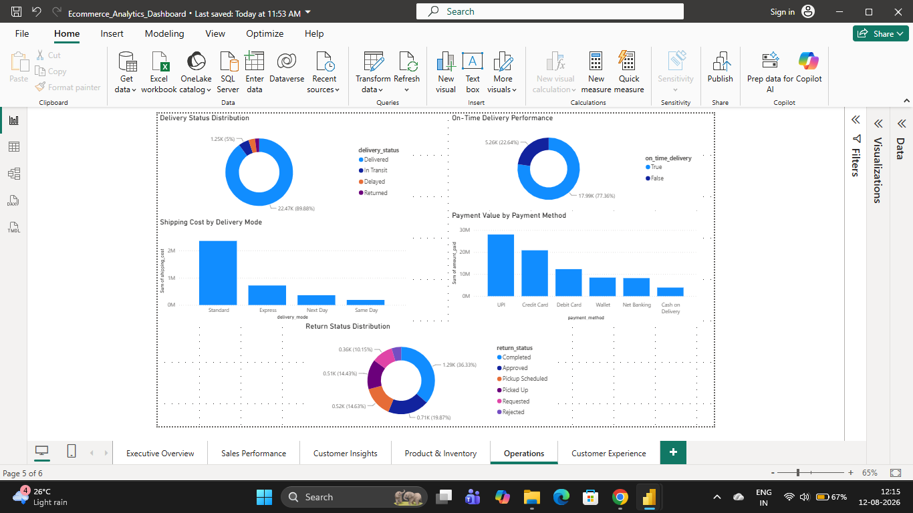
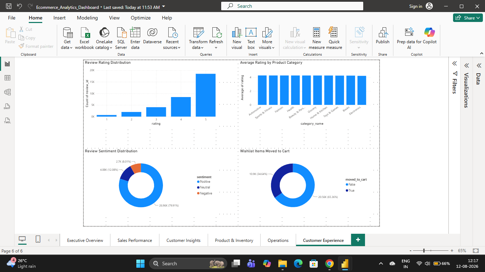

# E-Commerce Analytics & Business Intelligence Project

An end-to-end e-commerce analytics project built using PostgreSQL, Python, SQL, and Power BI.

This project is designed as a portfolio project to demonstrate practical skills in database design, data generation, SQL analysis, business intelligence, and dashboard development using an e-commerce business scenario.

## Project Overview

The project contains a PostgreSQL e-commerce database with 13 interconnected tables covering customers, products, orders, payments, shipments, reviews, returns, inventory, and wishlist activity.

Python scripts were used to generate the project datasets, PostgreSQL was used for database management and analysis, and Power BI was used to build an interactive business intelligence dashboard.

## Business Areas Analyzed

The project covers analysis of:

* Sales performance
* Customer behavior
* Product performance
* Inventory
* Returns
* Payments
* Shipping and delivery
* Customer reviews
* Wishlist activity

## Technologies Used

| Technology    | Purpose                                                     |
| ------------- | ----------------------------------------------------------- |
| PostgreSQL 18 | Database creation, management, views, indexes, and analysis |
| Python        | Synthetic e-commerce data generation                        |
| SQL           | Business analysis and reporting                             |
| Power BI      | Interactive dashboard and visualization                     |
| Git & GitHub  | Version control and project documentation                   |
| CSV           | Dataset storage                                             |

## Database Structure

The database contains 13 tables:

1. Customers
2. Addresses
3. Categories
4. Sellers
5. Products
6. Inventory
7. Orders
8. Order Items
9. Payments
10. Shipments
11. Reviews
12. Returns
13. Wishlist

The database uses primary keys, foreign keys, unique constraints, check constraints, default values, and relationships between the entities.

## Python Data Generation

The `scripts/` directory contains 13 numbered Python scripts used to generate the e-commerce datasets, along with `config.py`.

The scripts cover:

* Customers
* Addresses
* Categories
* Sellers
* Products
* Inventory
* Orders
* Order Items
* Payments
* Shipments
* Reviews
* Returns
* Wishlist

## Datasets

The `datasets/` directory contains the generated CSV datasets used by the PostgreSQL database:

* `customers.csv`
* `addresses.csv`
* `categories.csv`
* `sellers.csv`
* `products.csv`
* `inventory.csv`
* `orders.csv`
* `order_items.csv`
* `payments.csv`
* `shipments.csv`
* `reviews.csv`
* `returns.csv`
* `wishlist.csv`

These datasets correspond to the 13 database tables and are used for importing the generated e-commerce data into PostgreSQL.

## SQL Analysis

The `analysis/` directory contains 9 SQL analysis modules:

* `01_sales_analysis.sql`
* `02_customer_analysis.sql`
* `03_product_analysis.sql`
* `04_inventory_analysis.sql`
* `05_return_analysis.sql`
* `06_payment_analysis.sql`
* `07_shipping_analysis.sql`
* `08_review_analysis.sql`
* `09_wishlist_analysis.sql`

These modules analyze different areas of the e-commerce business using SQL.

## SQL Views

Reusable analytical views are defined in:

`sql/02_views.sql`

The project includes:

* `vw_sales_summary`
* `vw_sales_completed`

These views provide reusable datasets for sales-related analysis.

## Database Performance

Performance indexes are defined in:

`sql/03_indexes.sql`

Indexes were created across frequently queried columns in areas such as:

* Customers
* Products
* Orders
* Order Items
* Payments
* Shipments
* Reviews
* Returns
* Wishlist

## Power BI Dashboard

The Power BI dashboard is available in:

`powerbi/Ecommerce_Analytics_Dashboard.pbix`

The dashboard contains 6 analytical pages:

1. Executive Overview
2. Sales Performance
3. Customer Insights
4. Product & Inventory
5. Operations
6. Customer Experience

Dashboard screenshots are available in the `images/` directory.

### Executive Overview



### Sales Performance



### Customer Insights



### Product & Inventory



### Operations



### Customer Experience



## Project Structure

```text
ecommerce-analytics-business-intelligence/
│
├── analysis/
│   ├── 01_sales_analysis.sql
│   ├── 02_customer_analysis.sql
│   ├── 03_product_analysis.sql
│   ├── 04_inventory_analysis.sql
│   ├── 05_return_analysis.sql
│   ├── 06_payment_analysis.sql
│   ├── 07_shipping_analysis.sql
│   ├── 08_review_analysis.sql
│   └── 09_wishlist_analysis.sql
│
├── datasets/
│   ├── addresses.csv
│   ├── categories.csv
│   ├── customers.csv
│   ├── inventory.csv
│   ├── order_items.csv
│   ├── orders.csv
│   ├── payments.csv
│   ├── products.csv
│   ├── returns.csv
│   ├── reviews.csv
│   ├── sellers.csv
│   ├── shipments.csv
│   └── wishlist.csv
│
├── docs/
│   └── database_design.md
│
├── images/
│   ├── 01_executive_overview.png
│   ├── 02_sales_performance.png
│   ├── 03_customer_insights.png
│   ├── 04_product_inventory.png
│   ├── 05_operations.png
│   └── 06_customer_experience.png
│
├── powerbi/
│   └── Ecommerce_Analytics_Dashboard.pbix
│
├── scripts/
│   ├── 01_generate_customers.py
│   ├── 02_generate_addresses.py
│   ├── 03_generate_categories.py
│   ├── 04_generate_sellers.py
│   ├── 05_generate_products.py
│   ├── 06_generate_inventory.py
│   ├── 07_generate_orders.py
│   ├── 08_generate_order_items.py
│   ├── 09_generate_payments.py
│   ├── 10_generate_shipments.py
│   ├── 11_generate_reviews.py
│   ├── 12_generate_returns.py
│   ├── 13_generate_wishlist.py
│   └── config.py
│
├── sql/
│   ├── 01_schema.sql
│   ├── 02_views.sql
│   └── 03_indexes.sql
│
├── .gitignore
└── README.md
```

## How to Use

### 1. Create the Database

Create a PostgreSQL database and execute:

`sql/01_schema.sql`

This creates the database tables and relationships.

### 2. Load the Datasets

Import the CSV files from the `datasets/` directory into their corresponding PostgreSQL tables.

### 3. Create the Views

Execute:

`sql/02_views.sql`

### 4. Create the Indexes

Execute:

`sql/03_indexes.sql`

### 5. Run the Analysis

Explore the SQL analysis modules in the `analysis/` directory.

### 6. Open the Power BI Dashboard

Open:

`powerbi/Ecommerce_Analytics_Dashboard.pbix`

to explore the interactive dashboard.

## Skills Demonstrated

* Relational database design
* PostgreSQL
* SQL joins and aggregations
* Business-oriented SQL analysis
* Data generation using Python
* Database views
* Database indexing
* Power BI dashboard development
* Data visualization
* Business intelligence
* Git and GitHub

## Documentation

Additional database documentation is available in:

`docs/database_design.md`

## Author

Shrutikadu23

This project was developed as a portfolio project to demonstrate practical skills in SQL, PostgreSQL, Python, Power BI, database design, and business intelligence.

